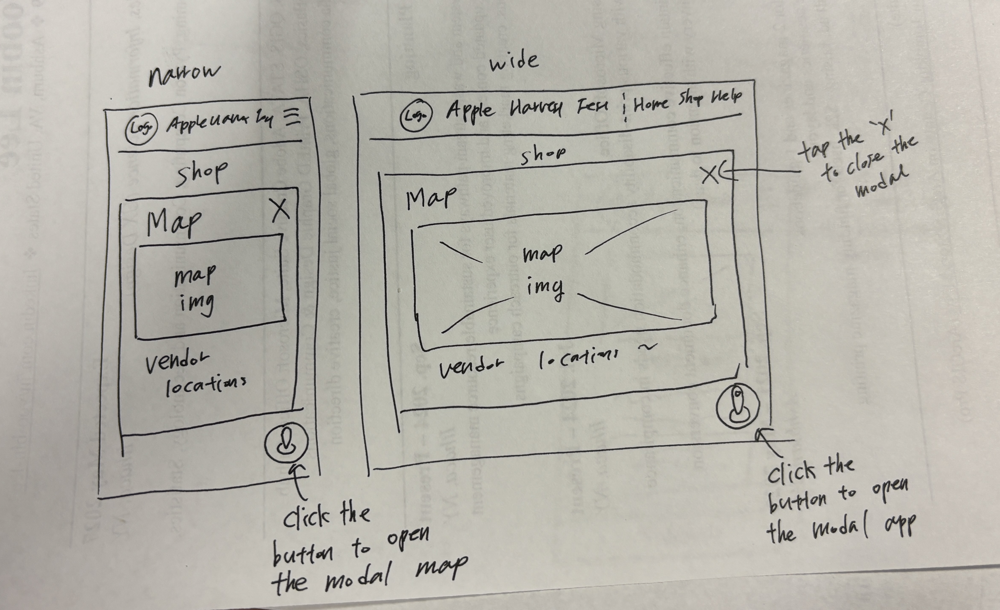
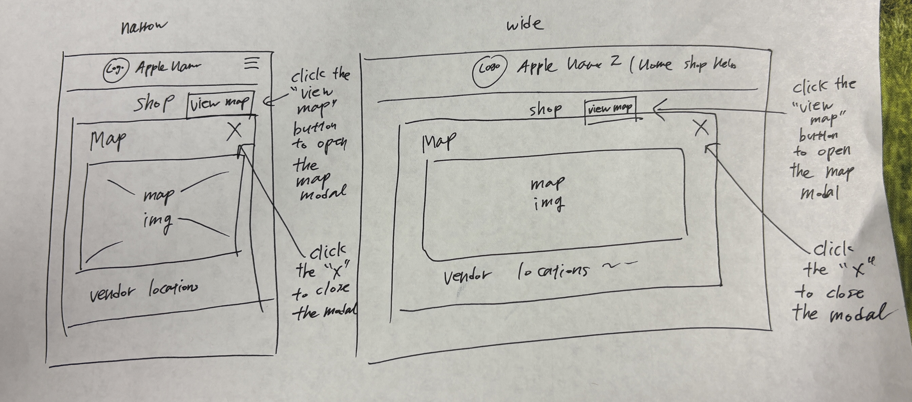
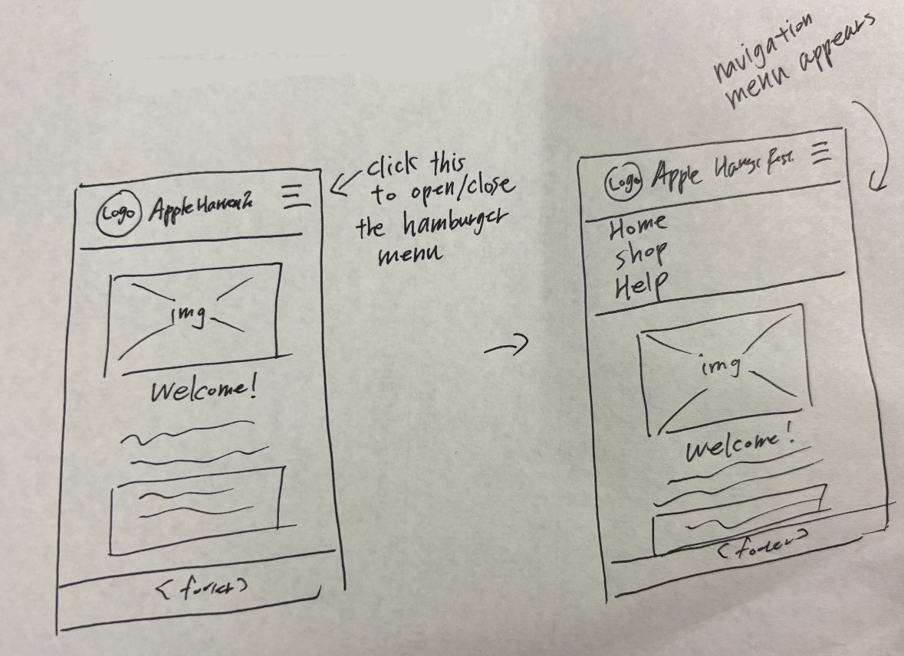
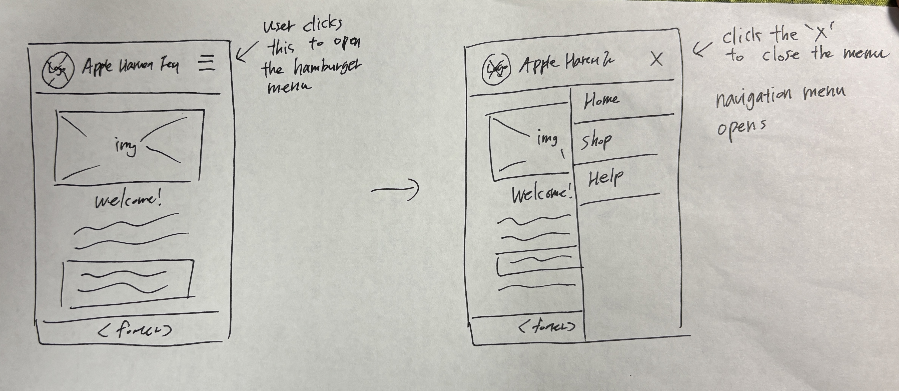
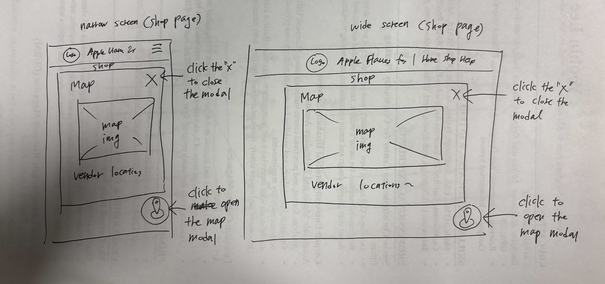
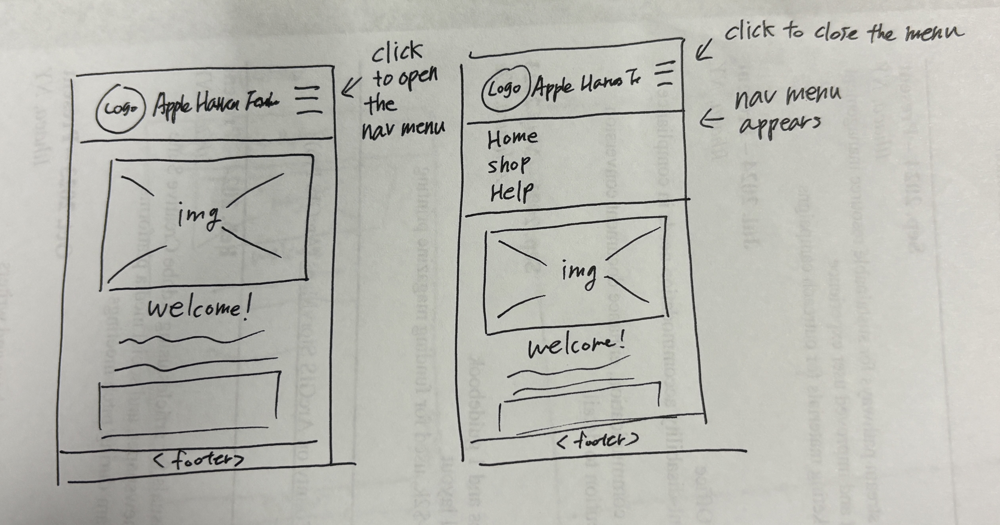
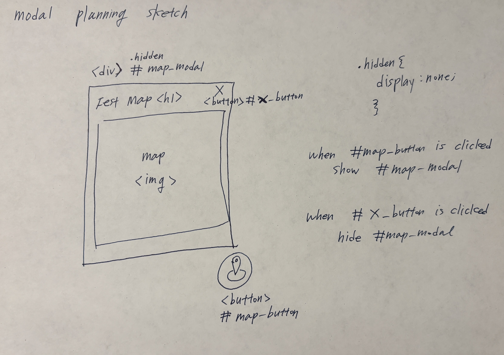
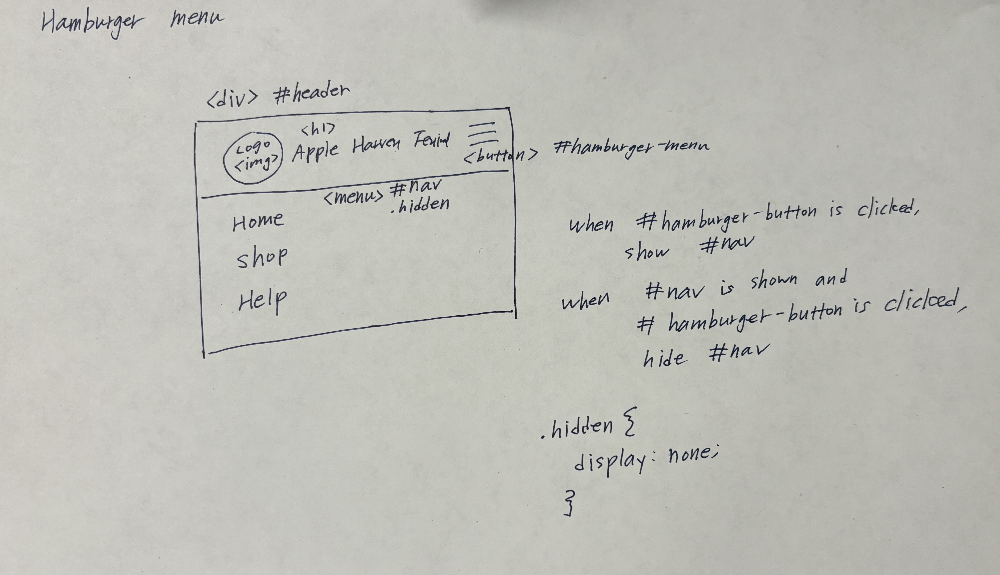

# Project 3, Milestone 1: Design Journey

[← Table of Contents](design-journey.md)


> **Replace ALL _TODOs_ with your work.** (There should be no TODOs in the final submission.)
>
> Be clear and concise in your writing. Bullets points are encouraged.
>
> Place all design journey images inside the "design-plan" folder and then link them in Markdown so that they are visible in Markdown Preview.
>
> **Everything, including images, must be visible in _Markdown: Open Preview_.** If it's not visible in the Markdown preview, then we can't grade it. We also can't give you partial credit either. **Please make sure your design journey should is easy to read for the grader;** in Markdown preview the question _and_ answer should have a blank line between them.


## Project
> Which project will you add interactivity to enhance the site's functionality?

Project 2


## Audience's Goals
> List the audience's goals that you identified in Project 1 or 2.
> Simply list each goal. No need to include the "Design Ideas and Choices", etc.
> You may adjust the goals if necessary.

1. Eat festival specific food.
2. Have a great time with their loved ones at the Apple fest.
3. Spend money on the Apple fest goods.


## Modal Interactivity Brainstorm
> Using the audience goals you identified, brainstorm possible options for **modal** interactivity to enhance the functionality of the site while also assisting the audience with their goals.
> Briefly explain each idea and provide a brief rationale for how the interactivity enhances the site's functionality for the audience. (1 sentence)
> Note: You may find it easier to sketch for brainstorming. That's fine too. Do whatever you need to do to explore your ideas.

- additional details Banner: A modal linking to the Downtown Ithaca website provides additional information about events, such as special activities for people and their loved ones.
- Map Banner on the Shop page: A modal map showing vendor locations allows quick access to festival-specific spots.
- Vendor Information Modal: Clicking on a vendor name could open a modal with vendor bios, product highlights, and location within the festival.


## Interactivity Design Ideation
> Explore the possible design solutions for the interactivity.
> Sketch at least two iterations of the modal and at least two iterations of the hamburger menu interactivity.
> Annotate each sketch explaining what happens when a user takes an action. (e.g. When user clicks this, something else appears.)
> Do not include HTML/CSS annotations in your sketches!

Modal iterations

iteration 1


iteration 2


Hamburger menu iterations

Iteration 1


Iteration 2



## Final Interactivity Design Sketches
> Create _polished_ design sketch(es) (it's still a sketch, but with a little more care taken to communicate ideas clearly to the graders) to plan your interactivity.
> **Sketch out the entire page where your interactivity will go.**
> Include your interactivity to the sketch(es).
> Add annotations to explain what happens when the user takes an action.
> Include as many sketches as necessary to communicate your design (ask yourself, could another 1300 take these sketches an implement my design?)

**Modal design sketches:**

Vendor map model on the Shop page


**Hamburger drop-down navigation menu design sketches:**




## Interactivity Rationale
> Describe the purpose of your proposed interactivity.
> Provide a brief rationale explaining how your proposed interactivity addresses the goals of your site's audience.
> This should be about a paragraph. (2-3 sentences)

The vendor map modal on the Shop page allows users to quickly locate vendors and navigate festival areas without leaving the page. The hamburger menu maintains a simple, user-friendly interface, efficiently displaying additional content, which is more effective on narrow screens.


## Interactivity Planning Sketches
> Produce planning sketches that include all the details another 1300 student would need to implement your interactivity design.
> Your planning sketches should include _all_ HTML elements needed for the interactivity; _annotations_ for the element types, their unique IDs, and CSS classes; and lastly the initial CSS classes.
> This is asking you to create a planning sketch like the one we did during the in-class activity.

**Modal planning sketches:**



**Hamburger drop-down navigation menu planning sketches:**




## Interactivity Pseudocode Plan
> Write your interactivity pseudocode plan here.
> Pseudocode is not JavaScript. Do not put JavaScript code here.

**Modal pseudocode:**

> Pseudocode to open the modal:

```
when #map-button is clicked:
  remove .hidden from #map-modal
```

> Pseudocode to close the modal:

```
when #x-button is clicked:
  add .hidden to #map-modal
```

**Hamburger menu pseudocode:**

> Pseudocode to show/hide (toggle) the navigation menu (narrow screens) when the hamburger button is clicked:

```
when the hamburger button is clicked:
  if the navigation menu is not visible:
    remove .hidden from #nav
  else:
    add .hidden to #nav
```

> Media queries are prohibited to show/hide the hamburger menu for this assignment.
> (I want you to demonstrate the interactivity learning objectives we covered in class.)
> If the browser window is narrow when the page loads, the hamburger button should be visible and the navigation should be hidden.
> If the browser window is wide when the page loads, the hamburger menu should not be visible.
> Complete the pseudocode to show/hide (toggle) the navigation on page load:

```
on page load (ready):
  if window is narrow:
    remove .hidden from #hamburger-button
    add .hidden to #nav
   else if window is wide:
     add .hidden to #hamburger-button
     remove .hidden from #nav
```

> If the browser window is resized from wide to narrow, the hamburger menu should become visible and the navigation should be hidden.
> If the browser window is resized from narrow to wide, the hamburger menu should become hidden and the navigation should be visible.

```
on window resize:
  if window is narrow:
    add .hidden to #nav
    remove .hidden from #hamburger-button
  else if window is wide:
    add .hidden to #hamburger-button
    remove .hidden from #nav
```


## References

### Collaborators
> List any persons you collaborated with on this project.

n/a


### Reference Resources
> Did you use any resources not provided by this class to help you complete this assignment?
> List any external resources you referenced in the creation of your project. (i.e. W3Schools, StackOverflow, Mozilla, etc.)
>
> List **all** resources you used (websites, articles, books, etc.), including generative AI.
> Provide the URL to the resources you used and include a short description of how you used each resource.

n/a


[← Table of Contents](design-journey.md)
