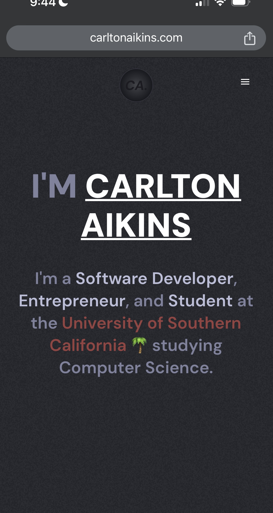
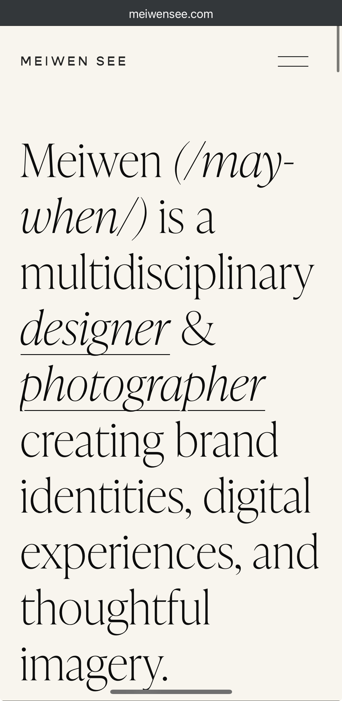

# Project 1, Milestone 2: Design Journey

[← Table of Contents](design-journey.md)

**Replace ALL _TODOs_ with your work.** (There should be no TODOs in the final submission.)

Be clear and concise in your writing. Bullets points are encouraged.

Place all design journey images inside the "design-plan" folder and then link them in Markdown so that they are visible in Markdown Preview.

**Everything, including images, must be visible in _Markdown: Open Preview_.** If it's not visible in the Markdown preview, then we can't grade it. We also can't give you partial credit either. **Please make sure your design journey should is easy to read for the grader;** in Markdown preview the question _and_ answer should have a blank line between them.

## Example Website CSS Property Analysis

For each example website you identified in milestone 1:

1. Include the same screenshot of the example website you included in Milestone 1.
2. Identify 2 parts of the design that you want to analyze for CSS properties.
3. For each part of the design, list the CSS properties for shape, color, and typography that you might use to create a similar design on your personal website.

### Example Website 1 CSS Property Analysis

<https://www.carltonaikins.com/>

1. Header

    Shape CSS Properties:

      - I think no shape CSS properties were used in the header.

    Color CSS Properties:

      - background-color: none;
      - color: white;

    Typography CSS Properties:

      - font-family: DM Sans Variable, sans-serif;
      - text-decoration: underline;

2. Introduction bio

    Shape CSS Properties:

      - I think no shape CSS properties were used in this section.

    Color CSS Properties:

      - background-color: none;
      - color: rgb(154 65 65);
      - color: rgb(187 190 218);
      - color: rgb(127 130 158);

    Typography CSS Properties:

      - font-family: DM Sans Variable, sans-serif;
      - font-size: 1.5rem;
      - font-weight: 600;

### Example Website 2 CSS Property Analysis

<https://www.meiwensee.com/>

1. Header bio

    Shape CSS Properties:

      - I think no shape properties were used in the header.

    Color CSS Properties:

      - background-color: none;
      - color: black;

    Typography CSS Properties:

      - text-decoration: underline;
      - font-size: 3.5rem;

2. Bottom "Let's work together" (not pictured in the screenshot)

    Shape CSS Properties:

      - border-style: solid;
      - border-radius: 0;

    Color CSS Properties:

      - color: black;
      - border-color: black;

    Typography CSS Properties:

      - font-family: sans-serif;
      - font-familyl: serif;

## CSS Styling Plan
> Pick one of the examples websites to use as inspiration to begin styling your personal website.
> Explain why you chose the example website and how you plan to use it as inspiration for styling your personal website.

I chose Carlton's website because of its simple, minimalistic design that effectively highlights key points in his bio. I plan to use this approach on my own website to showcase my work clearly without distracting the user.

## References

### Collaborators
> List any persons you collaborated with on this project.

N/A

### Reference Resources
> Did you use any resources not provided by this class to help you complete this assignment?
> Cite any external resources you referenced in the creation of your project. (i.e. W3Schools, StackOverflow, Mozilla, etc.)
>
> List **all** resources you used (websites, articles, books, etc.), including generative AI.
> Provide the URL to the resources you used and include a short description of how you used each resource.

<https://developer.mozilla.org/en-US/docs/Web/CSS/text-decoration>
I used it to identify the CSS underline property.

<https://cssreference.io/typography/> I used it to explore CSS typography properties.

[← Table of Contents](design-journey.md)
