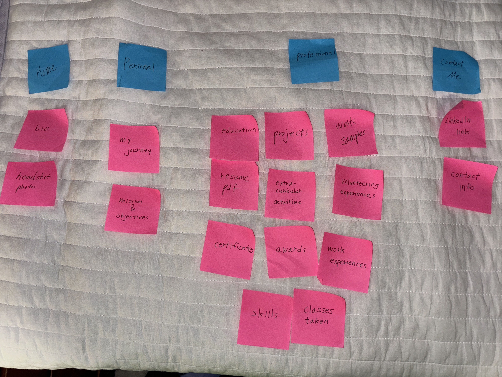
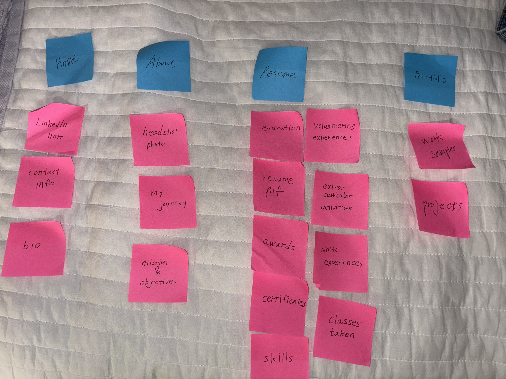

# Project 1, Milestone 3: Design Journey

[← Table of Contents](design-journey.md)

**Replace ALL _TODOs_ with your work.** (There should be no TODOs in the final submission.)

Be clear and concise in your writing. Bullets points are encouraged.

Place all design journey images inside the "design-plan" folder and then link them in Markdown so that they are visible in Markdown Preview.

**Everything, including images, must be visible in _Markdown: Open Preview_.** If it's not visible in the Markdown preview, then we can't grade it. We also can't give you partial credit either. **Please make sure your design journey should is easy to read for the grader;** in Markdown preview the question _and_ answer should have a blank line between them.

## Milestone 2 Feedback Revisions
> Explain what you revised in response to the Milestone 2 feedback (1-2 sentences)
> If you didn't make any revisions, explain why.

I added more content and images of my past design work samples to give my website's audience a clearer understanding of my capabilities and skills.

## Information Architecture

Design the information architecture for all the pages your website.

You may change your homepage content based on your card sorting. If you do change the homepage content, you don't need to go back to the previous milestone design journey and update it. Instead, just include the new plan in the section below (Content Organization).

### Content Organization
> Document your **iterations** of card sorting here.
> You should have at least 2 iterations of card sorting.
> Include photographic evidence of each iteration of card sorting **and** description of your thought process for each iteration. (1-2 sentences)
> Please physically sort cards; please don't do this digitally.

I sorted the cards/contents based on my personal side, professional side, and contact information.

In the first iteration, the professional section felt too crowded and had an overwhelming amount of content. To improve organization, I divided it into two sections: portfolio and resume. I also renamed the "Personal" section to "About" and moved the "Contact Me" content to the homepage, as the original "Contact Me" section didn’t have enough content in its own web page.

### Final Content Organization
> Which iteration of card sorting will you use for your website? (1 sentence)

I will use the second iteration for my website.

> Explain how the final organization of content is appropriate for your site's audiences. (1-2 sentences)

It is appropriate for my site's audiences because each section presents a manageable amount of information for them to process easily. By separating the resume and portfolio section, potential recruiters in the tech and design industries can focus on each section individually without feeling overwhelmed or distracted. 

### Navigation
> Please list the pages you will include in your website's navigation.

- Home
- About
- Resume
- Portfolio

> Explain why the names of these pages make sense for your site's audience. (1-2 sentences)

The page names are clear and intuitive, reflecting the natural grouping of content based on similarities and relevance to the audience's interests.

## References

### Collaborators
> List any persons you collaborated with on this project.

N/A

### Reference Resources
> Did you use any resources not provided by this class to help you complete this assignment?
> List any external resources you referenced in the creation of your project. (i.e. W3Schools, StackOverflow, Mozilla, etc.)
>
> List **all** resources you used (websites, articles, books, etc.), including generative AI.
> Provide the URL to the resources you used and include a short description of how you used each resource.

N/A

[← Table of Contents](design-journey.md)
