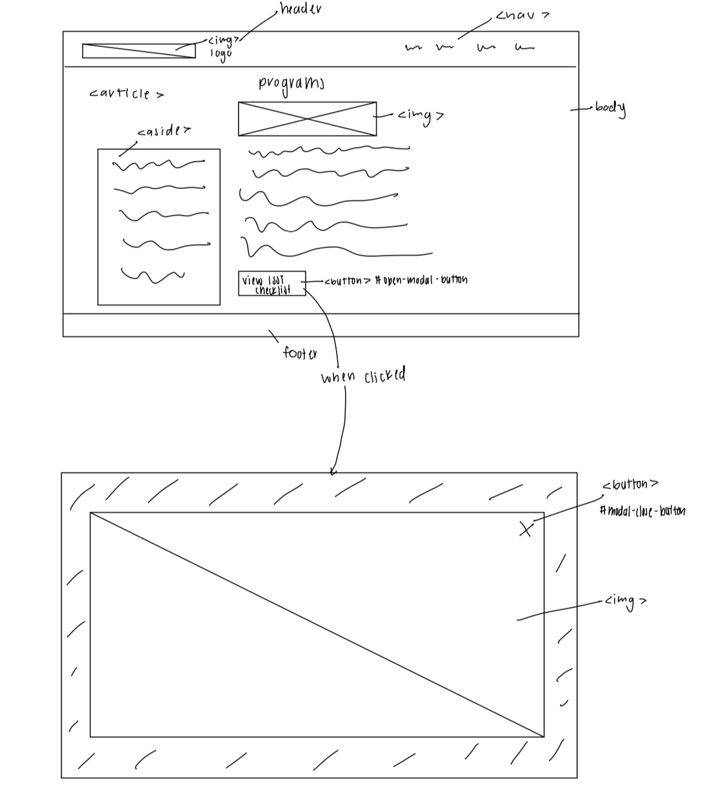

# Group Project, Final Milestone: Design Journey

[← Table of Contents](design-journey.md)


## Milestone 2 Feedback Revisions
> Explain what you revised in response to the Milestone 2 feedback (1-2 sentences)
> If you didn't make any revisions, explain why.

We decided to change our interactivity to allow the user to expand the major checklist. We felt like this aligned more with the users' goals.


## Interactivity Plan
> List the types of interactivity you plan to include in your project.
> Provide a brief summary (a few words) for each type of interactivity you plan to implement.

- Interactivity 1: Hamburger menu on a narrow screen. A hamburger menu that users can open and close whenever needed, providing more visual space on narrow screens.
- Interactivity 2: Button to expand ISST checklist to take up the whole screen in Programs page.


## Interactivity Design Sketches
> Create design sketch(es) to plan your interactivity's design.
> **Sketch out where your interactivity will go on the page itself.**
> For example, do not just sketch a carousel; instead, sketch the carousel on the page where it will appear.
> Add annotations to explain what happens when the user takes an action. (This is not pseudocode.)
> Include as many sketches as necessary to communicate your design (ask yourself, could another 1300 take these sketches an implement my design?)




## Interactivity Planning Sketches
> Produce planning sketches that include all the details another 1300 student would need to implement your design.
> Your planning sketches should include _all_ HTML elements needed for the interactivity; _annotations_ for the element types, their unique IDs, and CSS classes; and lastly the initial CSS classes.


## Interactivity Pseudocode Plan
> Write your interactivity pseudocode plan here.
> Pseudocode is not JavaScript. Do not put JavaScript nor snippets code here.

```
when #hamburger-button is clicked:
if the navigation menu is not visible:
 remove .hidden from #navmenu
else:
 add .hidden to #navmenu

when #open-modal-button is clicked:
 remove .hidden from #modal
 add "no-scroll" to "body"

when #close-modal-button is clicked:
 add .hidden to #modal
 remove "no-scroll" from "body"
```


## Interactivity Usability Justification
> Explain how the interactivity _functionally_ improves the user's experience and helps them accomplish their goals. (i.e. Your interactivity does _more_ than add additional clicks; the interactivity doesn't insert additional barriers for the user when working towards their goals.)
> Explain how your interactivity's design effectively uses affordances, visibility, feedback, and familiarity.
> Write a paragraph (3-4 sentences)

Implementing the hamburger menu for narrow screens allows the user to have a more familiar experience when using our site. The image of the three lines is familiar and easy to spot in the location where a user may expect it to be. The presence of the hamburger menu button suggests to the user that it is meant to be clicked. Clicking the button to reveal the navigation menu provides the user with the feedback that they anticipated.
Having a button to reveal the ISST checklist allows for the user to further explore this piece of content without having it interfere with the flow of the information of the page. Also, having a button that reveals this checklist allows the users to view the checklist in a larger format. The button is familiar to the user and the outline makes sure that the button is visible to the user. This allows the user to understand that the button can be pressed to perform the task that it is labeled with. Clicking the button reveals checklist which provides the user with immediate feedback.


## References

### Collaborators
> List any persons you collaborated with on this project.

Yoobin Lee, Emily Yoon, Sam Friedman, Naif Albasheer, Leonora Seferovic


### Reference Resources
> Did you use any resources not provided by this class to help you complete this assignment?
> List any external resources you referenced in the creation of your project. (i.e. W3Schools, StackOverflow, Mozilla, etc.)
>
> List **all** resources you used (websites, articles, books, etc.), including generative AI.
> Provide the URL to the resources you used and include a short description of how you used each resource.

- [Cornell Bowers Information Science Website](https://infosci.cornell.edu): Used to understand current site structure and content types.


[← Table of Contents](design-journey.md)
