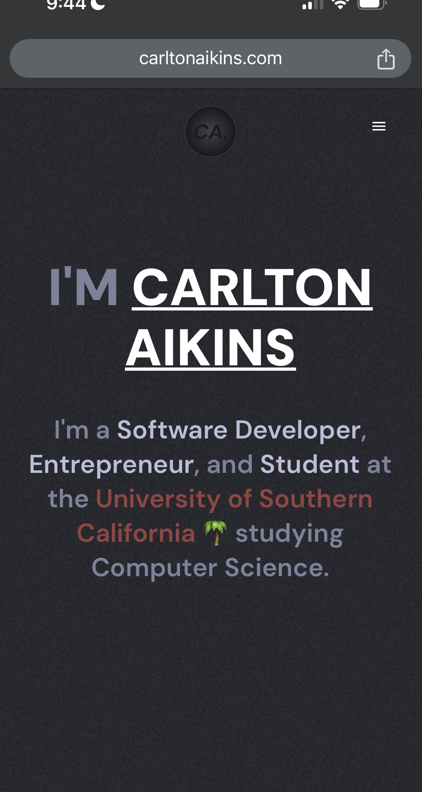
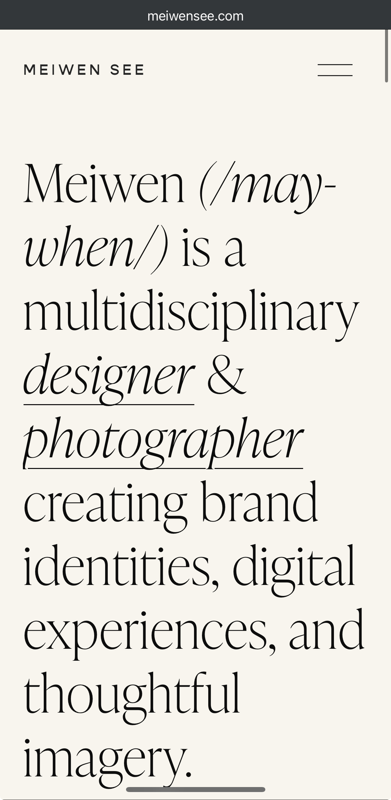
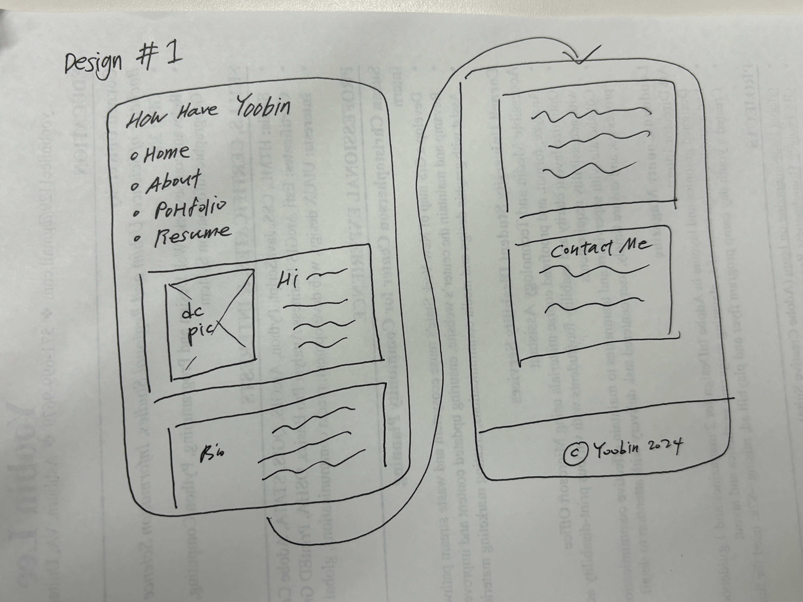
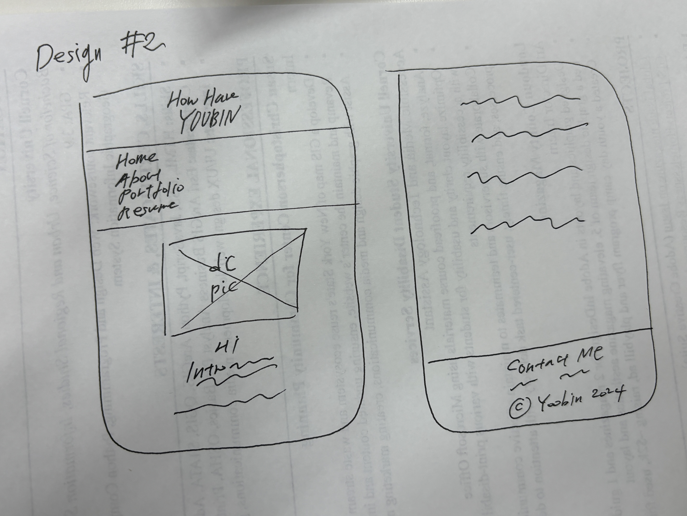
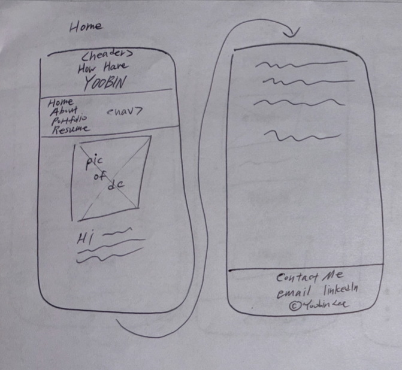
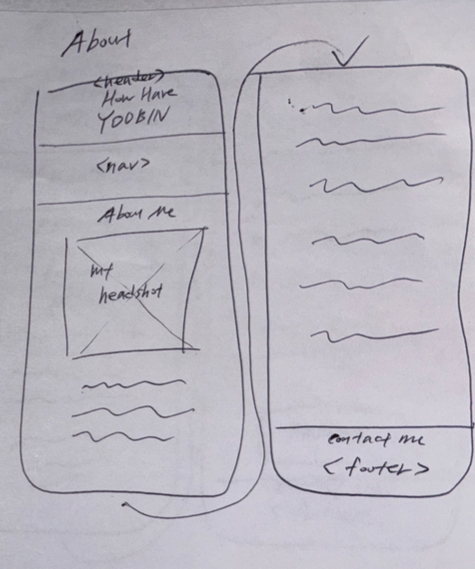
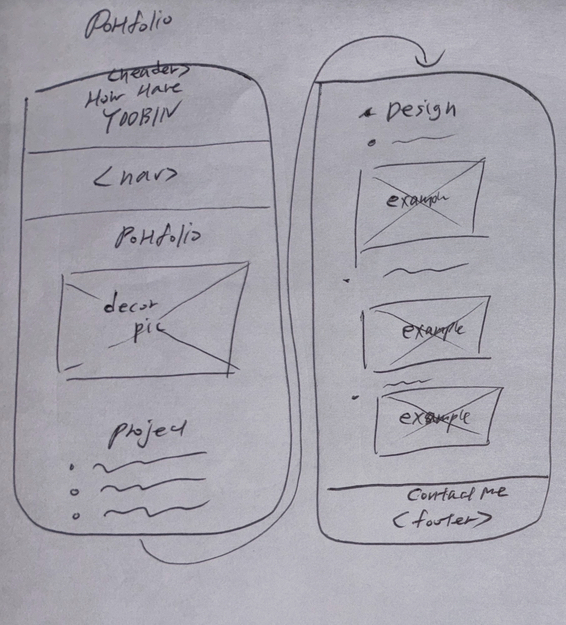
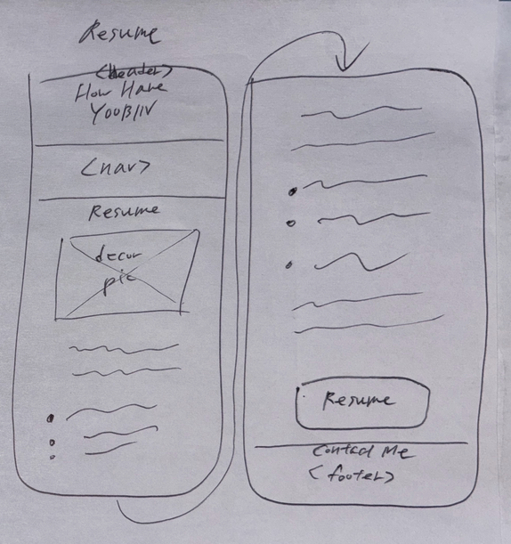

# Project 1, Final Milestone: Design Journey

[← Table of Contents](design-journey.md)

**Replace ALL _TODOs_ with your work.** (There should be no TODOs in the final submission.)

Be clear and concise in your writing. Bullets points are encouraged.

Place all design journey images inside the "design-plan" folder and then link them in Markdown so that they are visible in Markdown Preview.

**Everything, including images, must be visible in _Markdown: Open Preview_.** If it's not visible in the Markdown preview, then we can't grade it. We also can't give you partial credit either. **Please make sure your design journey should is easy to read for the grader;** in Markdown preview the question _and_ answer should have a blank line between them.

## Milestone 3 Feedback Revisions
> Explain what you revised in response to the Milestone 3 feedback (1-2 sentences)
> If you didn't make any revisions, explain why.

 I moved the images to the right directories, organized the image elements, and updated file names to lowercase. I also revised the content for better relevance and clarity.

While I originally planned to use Carlton's website for inspiration, I decided to switch to Website Example 2 since it does a better job at highlighting artistic and creative aspects of me.

## Example Website Emotion Analysis

For each example website you identified in milestone 1:

1. Include the same screenshot of the example website you included in Milestone 1.
2. Reflect on the emotions your experience when using the website.
3. Analyze how the website's use of color, decorative imagery, typography, shape, and alignment contribute to these emotions.

### Example Website 1
> Provide the website's URL and a screenshot

<https://www.carltonaikins.com/>

> What emotions do you feel when you look at this website's design? (1 sentence)

The website design evokes a sense of minimalism and charisma.

> How does this website's use of color, decorative imagery, typography, shape, and alignment contribute to these emotions? (2-3 sentences)

The website's dark gray background with a select color palette of varying intensities, gives each word a distinct weight. The use of white font and underlining highlights his name effectively, while the palm tree emoji and USC colors add a fun touch which also emphasizes Carlton's base location. The centered alignment, logo image, and sans-serif font contribute to a minimalist yet bold aesthetic.

### Example Website 2
> Provide the website's URL and a screenshot

<https://www.meiwensee.com/>

> What emotions do you feel when you look at this website's design? (1 sentence)

The website evokes a sense of calmness, soft, and artistic flair.

> How does this website's use of color, decorative imagery, typography, shape, and alignment contribute to these emotions? (2-3 sentences)

The use of a bright, pastel background color creates a calm, modern vibe, while the rounded serif font enhances the website's aesthetic appeal. Although the website doesn't have decorative imagery, the artistic use of special characters, underlining, and italicized typography adds a playful touch to the design. The left-aligned text forms a subtle, cohesive shape and is easier to read than center-aligned text, which could have created a crowded and disorganized appearance especially on the mobile screen.

## Website Design

### Emotion Reflection
> What emotions would you like the visitors of your website to experience? Why? (1-2 sentences)

I want visitors of my website to feel inspired, calm, and connected to a soft, artistic atmosphere, as it reflects the creative essence of my personal work.

### Design Principle Brainstorm
> Reflect on how you might use color, decorative imagery, typography, shape, and alignment to evoke these emotions. (2-3 sentences)

I plan to use soft, pastel colors like ivory and baby blue, incorporating these colors into decorative imagery to create a cohesive look. I will choose sans-serif fonts for a clean, calm aesthetic, and use rounded shapes to enhance the soft feel of the site. I will use center alignment to highlight section titles and left alignment for the main text to follow the natural reading flow.

### Home Page Sketches
> Sketch **two** different possible designs for your home page.
> Provide an explanation for each sketch explaining the idea. (1 sentence per sketch)

The header contains my name, and the navigation menu uses bullet points to indicate each webpage as a list; the main contents, including a decorative picture, intro, and contact information, are separated into white background boxes for clarity.

My name "Yoobin" is in a larger font than "How Have" to emphasize my name. The navigation menu and footer are enclosed in bordered white boxes to disgintuish them from the rest of the web content.

### Entire Website's Design
> Pick the version of the home page that you will use for your final design.

I am picking the second design sketch because it looks more organized than having multiple boxes for each section on the web pages.

> Plan the design for the rest of your website.
> Include a sketch for each of the remaining pages of your website.
> Label each sketch, so that we understand what page we are reviewing. (1 short phrase per sketch)

Home page

About page

Portfolio page

Resume page

### Static Website Design Check
> We're building a static website without interactivity.
> **No part of your website may dynamically change.**
> Examples of dynamic behavior are dropdown menus, hamburger menus, popups, modals/lightboxes, image carousels, etc.
> Audit your design and check that you aren't relying on any dynamic features. (1 sentence)

While the navigation bar visually indicates the currently active page by altering the font color to blue, there are no elements on the website that respond or adapt to user actions or input.

## Self-Reflection
> Take some time here to reflect on how much you've learned since you started this class. It's often easy to ignore our own progress. Take a moment and think about your accomplishments in this class. Hopefully you'll recognize that you've accomplished a lot and that you should be very proud of those accomplishments!

A few years ago, I took an online crash course on front-end development. While I found some concepts coming back to me, I quickly realized that that online class didn’t reflect industry best practices and that I had learned to use elements without fully understanding their purpose. In this course, I truly enjoyed turning my ideas and sketches into a real functional website. I’m proud to have started building a strong foundation in web development and feel ready to tackle new challenges in upcoming classes.

## References

### Collaborators
> List any persons you collaborated with on this project.

N/A

### Reference Resources
> Did you use any resources not provided by this class to help you complete this assignment?
> List any external resources you referenced in the creation of your project. (i.e. W3Schools, StackOverflow, Mozilla, etc.)
>
> List **all** resources you used (websites, articles, books, etc.), including generative AI.
> Provide the URL to the resources you used and include a short description of how you used each resource.

https://developer.mozilla.org/en-US/docs/Web/CSS/text-align
I used this to make sure how to use text alignment CSS property properly.

[← Table of Contents](design-journey.md)
